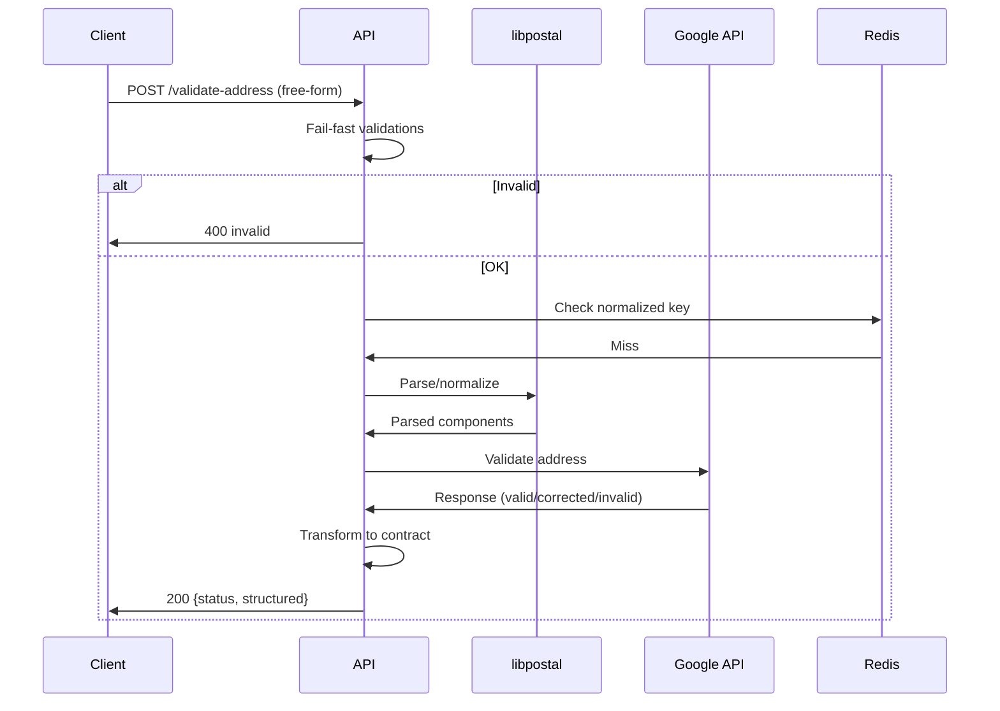

# Address Validation Service - Sync Approach

```mermaid
sequenceDiagram
    participant C as Client
    participant API as API
    participant L as libpostal
    participant G as Google API
    participant Cache as Redis

    C->>API: POST /validate-address (free-form)
    API->>API: Fail-fast validations
    alt Invalid
        API->>C: 400 invalid
    else OK
        API->>Cache: Check normalized key
        Cache->>API: Miss
        API->>L: Parse/normalize
        L->>API: Parsed components
        API->>G: Validate address
        G->>API: Response (valid/corrected/invalid)
        API->>API: Transform to contract
        API->>C: 200 {status, structured}
    end
```
