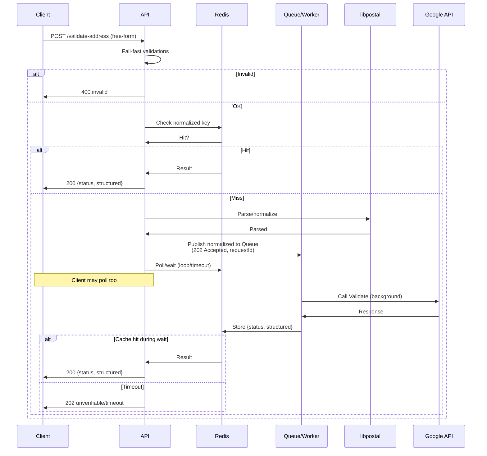

# Address Validation Service - Async Approach

```mermaid
sequenceDiagram
    participant C as Client
    participant API as API
    participant Cache as Redis
    participant QW as Queue/Worker
    participant L as libpostal
    participant G as Google API

    C->>API: POST /validate-address (free-form)
    API->>API: Fail-fast validations
    alt Invalid
        API->>C: 400 invalid
    else OK
        API->>Cache: Check normalized key
        Cache->>API: Hit?
        alt Hit
            Cache->>API: Result
            API->>C: 200 {status, structured}
        else Miss
            API->>L: Parse/normalize
            L->>API: Parsed
            API->>QW: Publish normalized to Queue<br/>(202 Accepted, requestId)
            API->>Cache: Poll/wait (loop/timeout)
            Note over API,C: Client may poll too
            QW->>G: Call Validate (background)
            G->>QW: Response
            QW->>Cache: Store {status, structured}
            alt Cache hit during wait
                Cache->>API: Result
                API->>C: 200 {status, structured}
            else Timeout
                API->>C: 202 unverifiable/timeout
            end
        end
    end
```